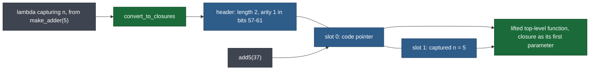
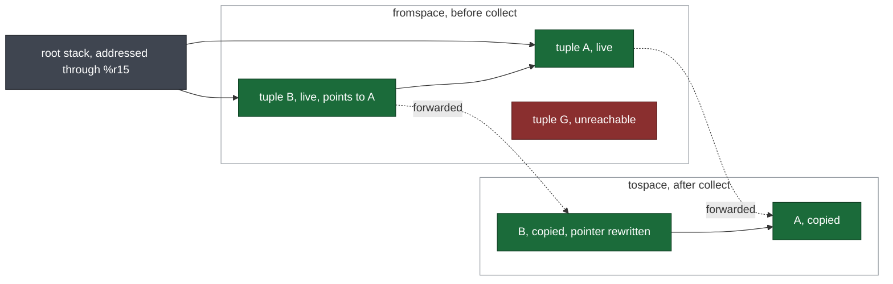
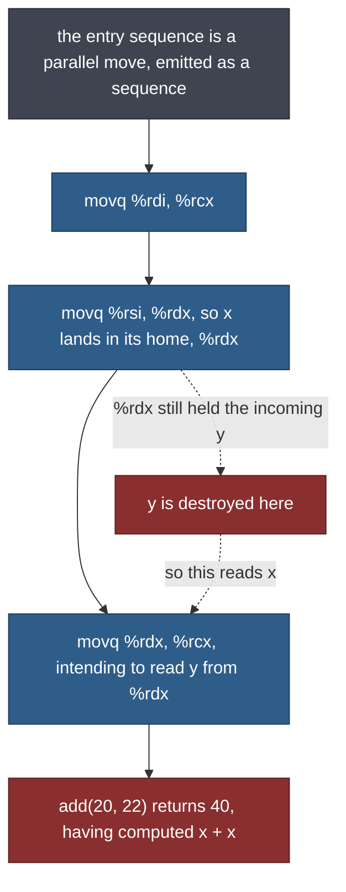

# mini-compiler

A C++17 compiler from a small ML-flavoured language to x86-64 assembly — graph-colouring register allocation, a Cheney copying GC, closures, dynamic typing — built to answer one question with receipts: **how much correctness does formal verification actually buy in a compiler, and which regime buys it?**

[](https://github.com/zakiller34/mini-compiler/actions/workflows/ci.yml)


## The measured answer

Five checking regimes ran against the same 20-pass compiler. What each actually caught:

| Regime | Live compiler bugs found | What only it could do |
|---|---|---|
| **Lean 4** — 36 theorems, syntactic tier | **0** | forced specifications to be precise; caught that the verification itself was fake |
| **Z3** — 33 SMT properties | 0 | proved a one-bit design constraint true of all 2⁶⁴ headers |
| **Tests** — 316 cases, 32 binaries | many, during development | transcription errors |
| **Differential harness** — 79 lines of shell | **1**, on its first run, that 287 tests had missed | asked whether the compiled program computes the same *value* |
| **Hoare contracts** — docstrings, unchecked by any tool | **1** latent heap-corruption bug | forced a property to be stated before it could be tested |

The honest headline: **the Lean development found zero bugs in the shipped compiler.** A 79-line shell script found the one that mattered. Git settles this rather than my memory — commit `982c882`, which replaced twenty vacuous theorems with real ones, changed 22 files and **not one of them under `src/`**.

That is not an argument against verification, but a measurement of what the *affordable* tier buys. The expensive tier demonstrably buys more: Yang et al. (PLDI 2011) threw a random program generator at every C compiler they could find, reported hundreds of bugs in GCC and LLVM, and found none in CompCert's middle end — verified for *semantics preservation*, not syntax. This project stopped short of that tier and prices exactly why below.

What the syntactic tier did buy is not defect discovery: **claims stop being decorative**. Twenty of thirty-five theorems here once asserted literally nothing while the build was green. That is now mechanically impossible, and it is the most transferable thing in the repository.

---

## See it run

```bash
cmake -B build -DCMAKE_BUILD_TYPE=Debug && cmake --build build

cat > adder.mc <<'EOF'
fn make_adder(n) { lambda (m) { m + n } }
let add5 = make_adder(5);
add5(37)
EOF

./build/src/mc --dyn adder.mc -o adder.s
gcc -o adder adder.s build/src/libmc_runtime.a -lm
./adder; echo $?                            # 42 — the value is the exit status

./build/src/mc --dyn -i adder.mc            # or interpret it, same answer
```

Three lines of source exercise most of the machine: `make_adder` returns a closure, so its free variable `n` is captured into a heap tuple the collector must trace; no annotations means every value carries a 3-bit runtime tag; `add5(37)` is an indirect call through a code pointer read out of that tuple.

The last command matters. For statically-typed programs the interpreter and the compiled binary share only the lexer, parser and type checker, so agreement is evidence and disagreement localises a fault. `tests/run_differential.sh` requires that agreement across all 50 programs, and it caught the miscompilation described below.

---

## The machine

The language grows in eight phases, each adding a feature and the passes to compile it. Chapters refer to Siek's [*Essentials of Compilation*](https://mitpress.mit.edu/9780262047760/) (2023), reimplemented from Racket in C++.

| Phase | Ch. | Language | What it added |
|---|---|---|---|
| 0 | — | — | CMake, GoogleTest, clang-tidy, changesets, a core-Lean-4 lakefile (no Mathlib), the AST hierarchy, `runtime/runtime.c` |
| 1 | 2 | L_Var | integers, `let`, `read()`, arithmetic; hand-written lexer and recursive-descent parser; an iterative interpreter; the first eight passes; 12 programs end-to-end |
| 2 | 3 | — | liveness, interference graph, DSATUR colouring, move biasing; 11 allocable registers, the rest spill; prelude saves only the callee-saved registers actually used |
| 3 | 4 | L_If | booleans, `if`, comparisons, short-circuit `and`/`or`; the type checker; `shrink`; `explicate_pred` and worklist block generation; `cmpq`/`setCC`/`jCC` |
| 4 | 5 | L_While | `while`, `set!`, `begin`, mutable variables; `uncover_get`; `NodeKind` dispatch replacing every `dynamic_cast`; Kildall worklist liveness over a cyclic CFG |
| 5 | 6 | L_Tup | heap tuples, Cheney two-space copying GC, root stack through `%r15`; `expose_allocation`; tuple spills addressed off `%r15` |
| 6 | 7 | L_Fun | top-level functions, System V ABI, tail calls; `reveal_functions`, `limit_functions`; per-function liveness, colouring and prologue |
| 7 | 8 | L_Lambda | lambdas, closure conversion, assignment conversion; `free_vars`; arity stored in the closure's heap tag |
| 8 | 9 | L_Dyn / L_Any | dynamic typing behind `--dyn`, 3-bit runtime tags, trapped errors exiting 255; `cast_insert` and `reveal_casts`; one shared L_Any traversal across nine passes |

Twenty passes carry a program from source to assembly, plus a free-variable analysis (`src/passes/free_vars.cpp`) shared by closure conversion. `src/main.cpp:76-125` runs them in exactly this order — coloured here by what Lean actually proves about each:


Green is proved by structural induction, gold is stated with a tracked `sorry`, blue is partly modelled, red is not modelled at all. The backend is uniformly red, and that is the boundary this whole document is about.

Every pass takes an AST or IR by const reference and returns a new one, so each is independently testable and every intermediate program is printable.

**Scope, so the numbers are not read for more than they are.** The language has integers, booleans, void, tuples and functions. No strings, no floats, no records, no modules, no separate compilation, no optimiser beyond move coalescing.

| | |
|---|---|
| Compiler | 12,802 lines C++17, 20 passes, 61 files |
| Tests | 316 cases in 32 binaries (24 without `libz3-dev`), 6,144 lines |
| Z3 properties | 33 — of which 15 are bit-exact over 64-bit vectors, the rest encode ABI, graph, liveness and typing facts |
| Lean | 36 theorems — 33 proved, 3 stated with tracked `sorry` — in 1,776 lines (1,650 model, 108 hygiene checker, 18 lakefile) |
| C runtime | 164 lines |
| End-to-end programs | 50, each run through both execution paths |

### Register allocation

DSATUR colouring (`src/passes/graph_coloring.cpp:157-182`) with move biasing tried before the greedy choice, so a `movq` whose ends share a colour can be deleted. Liveness is a Kildall worklist fixpoint re-enqueuing *predecessors* on change (`src/passes/liveness.cpp:203-249`), because `while` makes the CFG cyclic.

### Closures

A lambda becomes a heap tuple of its free variables plus a code pointer, its body lifted to a top-level function taking that tuple as an extra first parameter (`src/passes/convert_to_closures.cpp:70-79`). Variables both assigned *and* captured are boxed first (`src/passes/convert_assignments.cpp:403-406`), so mutation is shared rather than copied.



### The collector

A Cheney two-space copier (`runtime/runtime.c:127-164`). Tuple- and `Any`-typed variables cannot spill to the ordinary stack — the collector would not find them — so they spill to a *root stack* through `%r15`. Live objects are copied to tospace and a forwarding address is written back over the original's header (`runtime/runtime.c:86`); anything never reached is simply left behind when the spaces swap.



Every heap object carries a 64-bit header: bit 0 is the forwarding flag, bits 1–6 the length, bits 7+ a pointer mask saying which slots to trace; closures add arity in bits 57–61.

### Dynamic typing

The low three bits of every value are a tag: `001` int, `010` tuple, `011` procedure, `100` bool, `101` void. `000` is deliberately unused, so the collector can tell a tagged value from a plain 8-byte-aligned pointer. Dynamic integers are consequently 61-bit — three bits are stolen, silently. Under `--dyn` the program's value must be an `Int`, since it becomes the process exit status; anything else is a trapped error.

---

## Architecture as a correctness decision

Three choices in the C++ are there for the same reason the proofs are.

**No pass may recurse.** Every AST-rewriting pass is a defunctionalised stack machine over an explicit frame variant (23 kinds in `src/passes/convert_to_closures.cpp`), driven by a `while` loop. This costs real verbosity across nine passes and buys a property most teaching compilers lack: **the compiler cannot overflow its stack on a deeply nested program**, whatever the input. Termination is argued in the source too — 176 `// decreases` and `// invariant` annotations above the loops, across 29 files.

**One traversal, not nine copies of one.** The Phase 8 `L_Any` nodes are the easy ones to forget: ten of them, all carrying sub-expressions, all needing identical recursion in every rewriting pass. `src/passes/any_rebuild.h` defines that once — `any_children` / `rebuild_any` / `push_any_eval` / `build_any` — and each pass opens with `if (push_any_eval<EvalFrame>(e, stack)) return;`. Adding a node kind is a one-file change behind a switch the compiler checks. The bug class is not fixed nine times; it is made unrepresentable. Same move as the proof-hygiene gate below, applied to C++ instead of Lean.

**Conservatism where it is cheaper than cleverness.** An `Any`-typed variable live across a call gets an interference edge to *every* allocable register, forcing it onto the root stack, because it may hold a pointer the collector must trace (`src/passes/interference.cpp:117-119`, citing Siek §9.9). A tail-call target is stashed in `%rax` before the epilogue runs, because it may live in a callee-saved register the epilogue is about to pop.

---

## What is and is not proved

Every claim in this document should be read against this table.

| Property | Status |
|---|---|
| `shrink` eliminates every `and`/`or` | **proved** — structural induction |
| `reveal_casts` leaves no `inject`/`project`/predicate | **proved** — structural induction |
| `reveal_functions` leaves no `var` naming a function | **proved** — structural induction (about `reveal_expr`) |
| `uncover_get` leaves no `var` naming a mutable variable | **proved** — structural induction |
| Free variables of a lambda are all captured | **proved**, definitional (`List.mem_filter` restated) |
| A variable is boxed iff assigned *and* captured | **proved**, definitional |
| `let` and lambda parameters bind (not free in the result) | **proved**, definitional |
| Runtime tags separate the five shapes, and none is `000` | **proved** by `decide` over five literals |
| The coercion types cast insertion introduces are flat | **proved** as two point facts, not a universal |
| A failed projection reaches `Exit` (syntactically) | **proved**, definitional |
| Single-instruction liveness transfer; interference and colouring *specifications* | **proved** — see the caveat below |
| A-normal form after RCO | *stated, tracked `sorry`* (about a `sorry`d definition) |
| No shadowing after `uniquify` | *stated, tracked `sorry`* |
| Uniquify's counter is monotone | *stated, tracked `sorry`* |
| **Semantics preservation, for any pass** | **not modelled** |
| **Type progress and preservation** | **not modelled** in Lean¹ |
| **The entire backend** (explicate, select, assign homes, patch, prelude) | **not modelled** |

¹ A Z3 test checks a finite bit-vector encoding of progress; that is a sampled property of the encoding, not the theorem.

**The dataflow row is the weakest, so it is narrowed.** Nothing is proved about the liveness *fixpoint*: all three theorems concern the single-instruction transfer function, and `liveness_sound` is a verbatim alias of `live_before_contains_reads`. There is no interference-graph construction in Lean and no DSATUR — `dsatur_terminates` is `omega` on `n - (colored+1) < n - colored`, arithmetic wearing an algorithm's name. What the module holds is a *specification* of a valid colouring, proved symmetric, irreflexive and respected. Useful; not an algorithm proof.

**These are syntactic properties of a Lean model, not of the C++.** The model is a hand-written mirror; nothing checks that it matches the implementation, and where the two diverge the files say so — `revealCasts` hard-codes a temporary name where the C++ generates fresh ones and omits the shape check; `limit_functions` is the identity against 371 lines of C++. Two divergences are *not* yet commented and are disclosed here: `uniquify` and `uncover_get` drop `Program.defs`, and `uniquify` never renames lambda parameters. Proving things about the model catches design errors, not transcription errors — transcription is what the 316 tests and the differential harness are for.

**Semantics preservation is absent, and that is the interesting boundary.** `shrink_preserves_semantics` cannot even be *stated* without an operational semantics. The signature people reach for, `eval : Env → Expr → Option Value`, is insufficient in four separate ways: `set!` and `vectorSet` mutate, so it needs a store; `read` is I/O, so it needs an input stream; `while` and general application need not terminate, so Lean demands a fuel parameter; and a trapped dynamic type error is a third outcome, distinct from both "value" and "stuck". That is roughly 400 lines before a single theorem, plus a fuel-monotonicity lemma every later proof depends on — and each preservation theorem is days to weeks on its own. Verification cost is superlinear in language features; the syntactic tier is the affordable one, and this project stopped there deliberately.

---

## What verification actually bought

### Specification pressure

The highest-yield moment of the project involved no proof. It was writing the *proposition*.

The Lean model of `shrink` ended in a catch-all `| e => e`, commented as passing the Phase 8 nodes through unchanged. They do not pass through: `inject`, `project`, `anyVectorRef` and seven others carry sub-expressions. The moment the real statement was written — *every* `and`/`or` is eliminated — the proof refused to go through, correctly, because the proposition was false of the model. Seven analyses had the same defect; `revealCasts` did not recurse anywhere.

To be exact, since this is the finding most likely to be overstated: **those were bugs in the model. The C++ never had them** — `src/passes/any_rebuild.h` shipped in the same commit that introduced the `L_Any` nodes, and `git log 19c0903..HEAD` over all nine passes is empty. What the exercise found is that nine skipped cases hide behind a catch-all that reads as idiomatic completeness, and that review catches this in neither language.

The fixed theorem, in `lean/MiniCompiler/Passes/Shrink.lean`:

```lean4
theorem shrink_no_and_or (e : Expr) : noAndOr (shrink e) = true := by
  induction e using Expr.rec
    (motive_2 := fun es => noAndOrL (es.map shrink) = true) with
  | binary op l r ihl ihr => cases op <;> simp [shrink, noAndOr, ihl, ihr]
  | nil => simp [noAndOrL]
  | cons e es ih ihs => simp [noAndOrL, ih, ihs]
  | _ => simp_all [shrink, noAndOr]
```

A theorem of the form `p (f x) = true` is worthless if `p` is constantly true, and nothing in that statement rules it out. So the witness is checked in beside it and elaborated by every build, rather than asserted in a README:

```lean4
theorem noAndOr_is_falsifiable :
    noAndOr (.inject (.binary .or_ (.bool true) (.bool false)) .bool) = false := by
  decide
```

Before the fix, `shrink` left that witness untouched. The lesson: **specification is where the value is; the proof is the enforcement mechanism.** A theorem prover's real contribution is refusing to let a vague statement through.

### One bit, all 2⁶⁴ headers

Some properties are about *all* bit patterns, and a test can only sample. The tag encodings are that shape, so they go to the SMT solver over 64-bit bit-vectors (`tests/z3/test_tagging_z3.cpp`) — the negation is asserted, and UNSAT proves the property:

```cpp
/// @brief Scalars survive the tag round-trip over the representable range
/// ∀ v ∈ [-2^60, 2^60): ((v << 3) | 001) >>arith 3 == v
TEST(TaggingZ3, ScalarTagRoundTrip) {
    Ctx c;
    Z3_ast v = c.var("v");
    c.assert_ast(Z3_mk_bvsle(c.ctx, c.bv(-(1LL << 60)), v));
    c.assert_ast(Z3_mk_bvslt(c.ctx, v, c.bv(1LL << 60)));

    Z3_ast tagged = Z3_mk_bvor(c.ctx,
        Z3_mk_bvshl(c.ctx, v, c.bv(kTagShift)), c.bv(kTagInt));
    Z3_ast back = Z3_mk_bvashr(c.ctx, tagged, c.bv(kTagShift));
    c.assert_ast(Z3_mk_not(c.ctx, Z3_mk_eq(c.ctx, back, v)));
    EXPECT_TRUE(c.unsat());
}
```

One of the thirty-three justifies a design decision rather than confirming one: the object length starts at bit 1 because bit 0 is the forwarding flag. Had it started at bit 0, **every live object of odd length would read as already-forwarded**, and the collector would follow its length field as an address — silent heap corruption, unreachable by fuzzing, invisible to AddressSanitizer because the writes come from generated assembly. A single-bit constraint, true of all 2⁶⁴ headers, that no sampling test can even state.

### Verifying the verification

The most differentiated artifact here is `lean/Hygiene.lean`, which inspects every elaborated declaration and fails the build on a vacuous conclusion, a `sorry` outside a checked-in allowlist **of names** (a count would let a fixed `sorry` be silently replaced elsewhere), or a dependency on `Lean.ofReduceBool` — `native_decide`, the tactic that closes goals the kernel cannot check, which is exactly what you reach for when a proof is stuck and exactly the wrong trade here.

```lean4
/-- A conclusion with no content: `True`, a disjunction with a `True` side, or
    a reflexive equation. -/
def vacuousBody (b : Lean.Expr) : Bool :=
  b.isConstOf ``True
  || (b.isAppOfArity ``Or 2 && (hasTrue b.appFn!.appArg! || hasTrue b.appArg!))
  || (b.isAppOfArity ``Eq 3 && b.appFn!.appArg! == b.appArg!)
```

Two things it took a real run to learn. Filter by **module**, not namespace: `lean/MiniCompiler/AST.lean` opens no namespace and three pass files declare theorems at the root, so a `MiniCompiler.`-prefix test silently skips twelve theorems — the exact blind spot the checker exists to prevent. And gate on `!nm.isInternalDetail`, or you scan several hundred generated equation lemmas instead of real declarations. It is tested the only way a guard should be, by reintroducing the bug and watching `lake build` fail.

**Its limits, since a gate trusted past its range is worse than none.** It catches vacuity in `Or` and `Eq` only — not `A ∧ True`, `True → P`, or a reflexive `Iff`. It cannot tell that a statement is *false* of the model, nor that a true one is content-free: every definitional theorem in the table above passes it cleanly. A floor, not a quality bar.

### The false-statement taxonomy

Not every weak theorem can be made honest by writing the statement. `limit_functions` packs the parameters of over-arity functions into a tuple; the C++ does this in 371 lines, but the Lean model is `fun p => p`. So the natural statement, `∀ d ∈ (limit_functions p).defs, d.params.length ≤ 6`, is **false** of the model. Writing it with a `sorry` would leave the repository formally asserting something untrue, and anyone who later discharged that `sorry` would have derived `False`. A ranking, worth stating plainly:

1. Real statement, real proof.
2. Real, *true* statement with a tracked `sorry` — honest debt.
3. Vacuous statement — proves nothing, harms nothing except your credibility.
4. **False statement with a `sorry`** — actively poisonous.

Two theorems sat at (4) as their only honest option and were deleted, each with the reason recorded beside the model it was false of: `limit_functions_max_arity` in `lean/MiniCompiler/Passes/LimitFunctions.lean`, `cast_insert_types_any` in `lean/MiniCompiler/Passes/CastInsert.lean`. A vacuous theorem is useless; a false one is poison.

---

## Where it didn't pay — and what covered the gap

Each failure below was caught by a *different* regime, which is the actual argument for running several.

**Twenty theorems that proved nothing.** An audit found twenty of the then-thirty-five Lean theorems were this, while typechecking green:

```lean4
/-- Closure conversion preserves evaluation semantics. -/
theorem closure_conversion_preserves_semantics : ∀ _p : Program, True := by
  intro _; trivial
```

Valid Lean. Green build. Roadmap ticked. Two more were worse because they looked real — `tagof_injective_on_flat` concluded `… ∨ True`, and `project_inject_roundtrip` concluded `tagof t = tagof t`, reflexivity wearing the name of a round-trip property. It survives review because **every signal a reviewer uses is intact**: right file, honest-sounding name, correct docstring, short proof that reads as elegant rather than empty. The only wrong thing is the proposition between the colon and the `:=`, which is the one place a reader's eye skips. This is not a Lean quirk; it is the general failure mode of verification as a practice, and the same shape appears as a test asserting `expect(x).toBeDefined()` or an alert on a metric nobody emits. Hence the fix was not "fix the theorems" (one commit) but `lean/Hygiene.lean` (a build gate, permanent).

In the same family: `lean/MiniCompiler/Passes/RevealFunctions.lean` **had not compiled since Phase 8 landed** — the lakefile had no `globs` and nothing imported it, so two modules were never elaborated while the build stayed green. Fixed structurally with ``globs := #[.andSubmodules `MiniCompiler]`` plus a pre-commit assertion that every module is imported by the root. A green check mark is a claim about whatever was actually checked, and that set is itself worth checking.

**`add(20, 22) == 40`.** One live miscompilation, in territory the table marks **not modelled** — no proof discipline here could have caught it, because the Lean model stops before the backend. `fn add(x: Int, y: Int) : Int { x + y }` returned 40, and had since Phase 6, through two subsequent language phases and a then-287-case suite. The System V ABI passes arguments in `%rdi, %rsi, %rdx, …`, and a function's entry sequence is a **parallel move** emitted as a sequence:



Root cause: liveness tracks *variables*, and physical registers are invisible to it, so the interference graph had no edge and the allocator was free to home x in a register still holding y. The fix precolours parameter `i` against every argument register still holding a later parameter (`src/passes/assign_homes.cpp:173-182`). The caller side has no such hazard, for a checkable reason: `IndirectCallq` clobbers all caller-saved registers (`src/passes/interference.cpp:109-114`), so anything live across a call already interferes with every argument register.

Why did it survive? The function tests asserted *structure* — a `callq` emitted, a tail call becoming `jmp` — and single-argument functions cannot exhibit the bug. `tests/run_differential.sh` found it on its first run, because it asks the only question structural assertions cannot: does the compiled program compute the same value? The regression test now asserts the invariant itself rather than an example — no instruction in the entry mov run may read a register an earlier one wrote (`tests/integration/test_pipeline.cpp:701-708`) — verified by disabling the fix and watching it fail. A regression test never observed failing is itself an unfalsifiable claim.

**The allocator that checked for room too late.** The lightest regime caught the scariest bug. Phase 5's collector shipped with no direct tests; writing them found the collector fine and its *caller* wrong: `expose_allocation` emitted the heap-exhaustion check *after* bumping `free_ptr`. So an object could be placed past `fromspace_end`, and if the check did fire, `collect` ran before the fresh object was rooted — it was not copied, and `free_ptr` was reset back over it. It never manifested: allocator slack absorbed the overflow, shrinking the heap to 48 bytes still produced right answers, and AddressSanitizer cannot see writes from generated assembly. A latent memory-corruption bug testing could not provoke, found because writing a test for a *stated property* forced the question of whether the property held (`src/passes/expose_allocation.cpp:179-182`).

**The catch-all that was real.** The bug class the Lean model exposed does occur in the C++ — in a pass nobody modelled. `make_atom` in `explicate_control` ended in `default: return expr_cast<VarExpr>(e)`, reinterpreting *any* node kind as a `VarExpr`: an assert in a debug build, undefined behaviour in a release one. It was reached by `read() + 10`, found while fixing the parameter clobber, by neither proof nor model. The real repair was in `src/passes/rco.cpp:96,120-125`, which now let-binds `Read` instead of taking a shortcut, so `make_atom` never sees it; `make_atom` additionally throws and names the offending kind (`src/passes/explicate_control.cpp:33-43`). The model was right about the shape of the danger and looking in the wrong language.

### Who caught what

| Defect | Contracts | Tests | Z3 | Lean | Differential |
|---|---|---|---|---|---|
| 7 model analyses treating `L_Any` nodes as leaves | – | out of scope (model) | – | **found** | – |
| GC header: odd length reads as forwarded | – | cannot state | **proved impossible** | – | – |
| 20 vacuous theorems | – | – | – | **`lean/Hygiene.lean`** | – |
| `lean/MiniCompiler/Passes/RevealFunctions.lean` unbuilt | – | – | – | **found** (globs + import check) | – |
| Parameter clobber, `add(20,22)==40` | missed | missed | out of scope | not modelled | **found** |
| `make_atom` catch-all, UB in release | missed | missed | – | not modelled | – (found while fixing the above) |
| Heap check emitted after allocation | **found** (writing the test for the stated property) | latent | – | not modelled | – |

Five regimes, seven defect classes, no regime dominant. Each caught defects only in its own region — which is what defense in depth looks like, and the honest version of "formal verification adds value": not that proofs replace tests, but that each regime states a kind of claim the others structurally cannot.

---

## Known gaps

Stated here so a reader does not have to find them.

- **Contracts are documentation, not a checked regime.** Roughly three-quarters of functions carry `@requires`/`@ensures`; no tool reads them. The IR headers (`src/ir/x86_ir.h`, `src/ir/c_ir.h`) and four backend passes have none — including `src/passes/assign_homes.cpp`, whose parameter-clobber fix is justified by a prose comment rather than a postcondition.
- **The differential harness is weaker under `--dyn`.** For the ten Phase 8 programs the interpreter path also runs `shrink`, `uniquify`, `reveal_functions` and `cast_insert`, so a fault inside those four cannot be localised by disagreement. The sharing is deliberate — both paths must agree on where casts happen — but it narrows the claim.
- **Nothing links the Lean model to the C++.** The standard closures are translation validation (check each compilation, not the compiler), extraction (generate the implementation from the model), or the cheap version: run model and pass over the same ASTs and diff. None is done here.
- **Source positions do not survive the pipeline.** Errors report `file:line:col`, but passes rebuild nodes without propagating positions, so a pass-synthesised node reports no position rather than a wrong one.
- **CI reports formatting but does not fail on it.** The tree does not satisfy its own `.clang-format`; the correction is a ~3,600-line mechanical diff that has not been taken, and it is stated here rather than hidden behind a passing check.
- **No BNF grammar spec.** The grammar lives as a comment in `src/parser.h`.
- `color_graph` takes a `num_regs` parameter it never reads; the spill decision lives in `src/passes/assign_homes.cpp:202`.
- Tail calls are enabled inside function definitions, not in the main body.
- All 20 passes are const-in/new-out, but `src/main.cpp:81-82` mutates a `Program` in place between two of them.

**Phase 9 was declined, not skipped.** Gradual typing — mixing static and dynamic types behind an `Any` annotation — is the book's next chapter, and it is deliberately out of scope. The remaining effort was worth more spent making the existing eight phases *true*, given that the Lean development contained twenty theorems proving nothing and a live miscompilation of multi-argument calls, than on a ninth phase built on top of that. Higher-order casts also require proxy objects, which is the point where the verification story would have to be abandoned entirely rather than merely bounded.

Next, in order of value: an operational semantics for the frontend (which unlocks the preservation theorems), discharging the three tracked `sorry`s, and that BNF grammar per phase.

---

## Building it

```bash
cmake -B build -DCMAKE_BUILD_TYPE=Debug && cmake --build build
ctest --test-dir build --output-on-failure   # 32 binaries, 316 cases (24 without libz3-dev)
./tests/run_differential.sh                  # 50 programs, both execution paths

cd lean && lake build                        # proofs + the hygiene checker
./scripts/check_honesty.sh                   # fast pre-commit gate
```

Toolchain: C++17 / CMake / GoogleTest / Z3 C API / Lean 4 v4.29.0-rc1 (core only — no Mathlib) / clang-tidy on every build / GitHub Actions. CI runs the cold build — where clang-tidy's function-size gate actually fires, since incremental builds skip untouched files — plus the tests, the differential harness, and `lake build` including the proof-hygiene checker.

**Start here**, if you read three files: `lean/Hygiene.lean` (verification of the verification, 108 lines), `src/passes/assign_homes.cpp` (register allocation and the clobber fix), `src/passes/any_rebuild.h` (making a bug class unrepresentable).

---

## Reference

Siek, J. G. (2023). *Essentials of Compilation: An Incremental Approach in Racket*. MIT Press. ISBN 9780262047760.

Yang, X., Chen, Y., Eide, E., & Regehr, J. (2011). Finding and understanding bugs in C compilers. *PLDI '11*.
